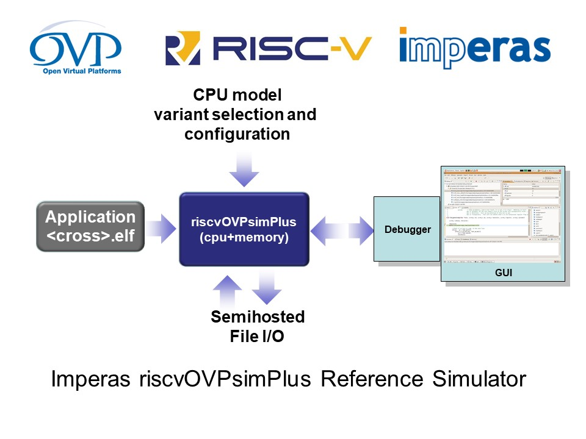

# Imperas RISC-V riscvOVPsim reference simulator and architectural validation tests
**riscvOVPsim** is released by Imperas based on their 12+ years of developing commercial industrial grade, reference simulators for advanced processor architectures. It is a free closed source simulator binary that works with no compiling, no fiddling, and no external dependencies, it just works.

In the RISC-V world, Imperas simulators are used by most companies and organizations that are serious about getting quality RTL working and signed off. They use it as an architectural reference and many use it as the golden simulator to verify their RTL in a hardware design verification methodology. Imperas simulator technology and verification IP is the technology to use to obtain high quality results and to verify RTL works as expected.

The following is a list of some of the companies and organizations that rely on Imperas simulators as their RISC-V reference:

Mellanox/Nvidia, Seagate, MIPS, NSITEXE/Denso, Google Cloud, Chips Alliance, lowRISC, OpenHW Group, Codasip, SiFive, Andes, Valtrix, Nagra/Kudelski, Silicon Labs, Incore Semi, NXP, Dolphin Integration, RISC-V Compliance Working Group, ...

This download contains a binary of the Imperas configurable reference simulator, a test framework to run the simulator or your device-under-test, and tests to run on several targets. Use the tests to check ISA compliance of your device.

This Imperas test framework has formed the basis of the RISC-V International (riscv.org) Compliance Working Group's test suite since 2018. It is based on simple Makefiles and simple bash scripts and so requires no complex installations, version issues, or any changing dependencies. You simple select a test suite, a target, and run. 

In May 2022 RISC-V International's Architectural Test SIG (formerly the compliance working group) has moved to using a Python program/framework v3.0 to run compliance testing and no longer provides signatures or scripts to run targets against their tests. As a service to RISC-V processor developers, Imperas ports the RVI tests to the Imperas test framework and makes them available as part of the Imperas test downloads. This means you can use all of the Imperas tests and all of the RVI tests from one simple make/bash framework. The RISC-V International tests have the -RVI suffix to their test suite dirs. See below to access these tests.

### About the riscvOVPsim simulators
The **riscvOVPsim** simulators implement the full and complete functionality of the RISC-V Foundation's public User and Privilege specifications.

They have been developed for personal, academic, and commercial use, and the model is provided as open source under the Apache 2.0 license.

**riscvOVPsim** and **riscvOVPsimPlus** include an industrial quality model and simulator of RISC-V processors for use for compliance and test development. The simulators are provided under the  Open Virtual Platforms (OVP) Fixed Platform Kits license that enables download and usage. The test suites are provided under an OVP open source license. The simulators are actively maintained and enhanced by Imperas. To ensure you make use of a current version, releases will expire. Please download the latest version.

The RISC-V OVPsim fixed platform simulators come in two flavors. Both free.

**riscvOVPsim** is available from [www.GitHub.com/riscv-ovpsim](https://github.com/riscv-ovpsim/imperas-riscv-tests), while **riscvOVPsimPlus** is available from the [OVPworld.org library page](https://www.ovpworld.org/library/wikka.php?wakka=riscvOVPsimPlus).

#### riscvOVPsim
This simulator is for use in running tests - especially the RISC-V compliance test suites.

It includes full commercial features including variant selection, semi-hosting, functional coverage reporting, and RISC-V International compliance suite signature dump facilities. 

RISC-V 32 and 64bit ratified instruction extensions are selectable (including IMAFDCSUE). 
See the GitHub [riscv-ovpsim/README.md](https://github.com/riscv-ovpsim/imperas-riscv-tests/blob/master/riscv-ovpsim/README.md) and 
           [riscvOVPsim_User_Guide.pdf](https://github.com/riscv-ovpsim/imperas-riscv-tests/blob/master/riscv-ovpsim/doc/riscvOVPsim_User_Guide.pdf) for more information.

#### riscvOVPsimPlus
This extends the functionality of riscvOVPsim and provides many more features including full configurable instruction trace, GDB/Eclipse debug, and memory configuration options. Additionally in the model are: CLIC, Debug Module/Mode, multi-hart, H-hypervisor simulation, and also the recently ratified ISA extensions: V-vector, B-bitmanip, K-crypto(scalar), and Zfinx, and the 'near-ratified' P-SIMD/DSP, Zmmul. 

(Extensions still with a lot to be developed before ratification including K-crypto (vector), Zce (code size reduction), and user custom extensions, are available in Imperas simulators from [Imperas](https://www.imperas.com/riscv)).

For more information see the 
   [riscv-ovpsim-plus/README.md](https://github.com/riscv-ovpsim/imperas-riscv-tests/blob/master/riscv-ovpsim-plus/README.md) and 
[riscvOVPsimPlus_User_Guide.pdf](https://github.com/riscv-ovpsim/imperas-riscv-tests/blob/master/riscv-ovpsim-plus/doc/riscvOVPsimPlus_User_Guide.pdf) for more information.

If you need a copy of riscvOVPsimPlus - get it from the [OVPworld.org library page](https://www.ovpworld.org/library/wikka.php?wakka=riscvOVPsimPlus).

    
### Imperas test suites
When verifying a CPU design - you can never have enough tests...

Imperas have developed a directed RISC-V test generator, functional coverage measuring VIP, and a test qualifying mutating fault simulator to provide high quality test suites.

For the RISC-V vector instructions and vector engines there are many configuration options and the vector test suites need to be created for each specific set of options. We have included one configured test suite as an example - for other configurations, please contact info@imperas.com.

We have also developed a suite of tests for PMP and like the vector tests they are configurable for different designs so please contact Imperas for more information.

The riscvOVPsim package only includes the RV32I suite, and the riscvOVPsimPlus packages include all current released publicly available test suites.

To review the tests suites view: [riscv-test-suite/README.md](riscv-test-suite/README.md).

To view the details of the specific test suites, look in the test suite directories, 
for example: [riscv-test-suite/rv32i_m/I/README.md](riscv-test-suite/rv32i_m/I/README.md)

### RISC-V International Architectural Validation tests are now included in Imperas test suites
As a service to Imperas users, we have imported the current suite of RVI compliance tests and have them working in our make/bash framework. We also run them through our reference simulator and generate reference signatures so you can easily compare our golden signatures with your DUT generated signatures.
The RVI test suites all have the suffix -RVI in their names, for example rv32i_m-RVI.

### Using the test suites
In the [riscv-target](riscv-target) is a directory for each target simulator/device.

To use the test suites, we recommend adding a similar target directory to drive your device-under-test. Contact info@imperas.com if you need assistance.

### Downloading the simulator and tests
For the GitHub version that you can use for running, for example, the RISCV.org compliance test suites, visit [github.com/riscv-ovpsim/imperas-riscv-tests](https://github.com/riscv-ovpsim/imperas-riscv-tests).

For the more advanced version, with full tracing and extra features, and the F and D Floating Point and latest ISA extensions such as V-vector, B-bitmanip, K-crypto(scalar), and P-SIMD/DSP, you need **riscvOVPsimPlus** so visit [OVPworld.org library page](https://www.ovpworld.org/library/wikka.php?wakka=riscvOVPsimPlus). This is still free, and as it is hosted on OVPworld it requires OVP registration.

### Running the tests
To run the tests you need to have a configured target (e.g. riscvOVPsim and a tool chain set up).

A pre-compiled GCC, for 64-bit Linux hosts, for RISC-V can be obtained from the [Imperas GitHub](https://github.com/Imperas/riscv-toolchains). There are multiple branches.

For example, for the toolchain to support all ISA including the vector instruction v0.8 use:

    git clone https://github.com/Imperas/riscv-toolchains.git --branch rvv-0.8.x
    mv riscv-toolchains riscv-toolchains-rvv-0.8.x

For example, for the toolchain to support all ISA including the vector instruction v0.9 use:

    git clone https://github.com/Imperas/riscv-toolchains.git --branch rvv-0.9.x
    mv riscv-toolchains riscv-toolchains-rvv-0.9.x

and then set up (for 0.8.x for base and current vector tests):

    export TOPDIR=<your dir in which you cloned riscv-toolchains>

    # for vector rvv-0.8.x
    RISCV_TUPLE=riscv64-unknown-elf
    export RISCV_PREFIX=${RISCV_TUPLE}-
    export RISCV_TOOLCHAIN=${TOPDIR}/riscv-toolchains-rvv-0.8.x/Linux64/sifive-riscv-none-gcc
    export PATH=${PATH}:${RISCV_TOOLCHAIN}/bin

and then to obtain the tests, you will have either:

  riscvOVPSim - cloned the repository from GitHub:

    git clone https://github.com/riscv-ovpsim/imperas-riscv-tests
    
  riscvOVPsimPlus - unzipped the riscvOVPsimPlus.zip file from the OVPWorld website
  
    unzip riscvOVPsimPlus.zip

and then to run:

    cd imperas-riscv-tests

    make help
    make clean simulate verify postverify XLEN=32 RISCV_DEVICE=I
        
    and set RISCV_TARGET to either riscvOVPsim or riscvOVPsimPlus, for example RISCV_TARGET=riscvOVPsim

# Using Imperas simulators for Hardware Design Verification (HW DV)

For the best hardware verification environments engineers need a multitude of advanced tools. Imperas has a large collection of tools and technologies that assist the commercial RTL CPU developer to get their RTL signed off in the shortest possible time.

Here is a list of some of the technologies/tools/products that Imperas provides to commercial users:

* standard models of all RISC-V extensions and features with full RISC-V envelope and configuration
* extendable models to enable each user to specify their exact processor features and custom extensions
* range of simulators from free on GitHub.com to commercial on Imperas.com that can boot RISC-V SMP Linux in under 10 secs on regular PC
* Verification IP for encapsulation of CPU models into SystemVerilog testbenches
* Verification IP for integration of CPU models into SystemVerilog testbenches for full HW DV
* Verification IP block to provide micro-architectural synchronization for advanced Step/Compare HW DV
* Verification IP to produce source SystemVerilog functional covergroup and coverpoints for different ISA extensions
* very large library of standard CPU and behavioral component models so you can build your own virtual platforms
* standard ISA test suites to aid with ISA compliance
* custom ISA test suites configured for specific customer requirements
* Vector ISA test suite (7,000+ tests) generated for customer specific VLEN, SLEN, ELEN, XLEN, and vector versions
    * e.g.:  RV32V_8192_8192_32, RV64V_256_256_64, RV64_512_512_32, RV64V_256_256_32, ...
* Privilege mode PMP test suites customized to customer specific options

Please visit [imperas.com/riscv](https://www.imperas.com/riscv) for more information or contact info@imperas.com.

# Using Imperas simulators and virtual platforms for software development
### Debugging using GDB / Eclipse

The riscvOVPsimPlus, and simulators from OVPworld, and Imperas can be used to debug applications using GDB and Eclipse.

For GDB debug a command line argument is provided to start the GDB debugger and connect to the virtual platform, and for Eclipse debug, using CDT, a configuration to attach to an external remote application for debug can be made. 
Please see the [riscvOVPsimPlus user guide](riscv-ovpsim-plus/doc/riscvOVPsimPlus_User_Guide.pdf) for full details.

### Virtual Platforms and large component library
There is an extensive range of over 250+ processors and 300+ other models included in the Imperas OVP library. View the library:  [www.OVPworld.org/library](https://www.OVPworld.org/library).

Most models are available under an Apache 2.0 open source license.

These models are created using the ease of modeling provided by the OVP APIs. APIs are available for modeling platforms, processors, behavioral models and peripherals, each optimized for the particular modeling style required. The modeling standards allow for functionality to be included quickly while maintaining model performance and ease of use, reducing a typical multi-month development project down to just a few weeks.

All models run in standard C and C++ environments, and also may be incorporated within a SystemC environment. The models are delivered with a bus transactional interface and this has been leveraged to provide a high speed TLM 2.0 interface layer that allows their use in a SystemC TLM 2.0 environment, enabling the fastest possible simulation performance

### Advanced Verification, Analysis and Profiling tools
Advanced tools from Imperas include:
* Configurable Instruction Tracing
* Function Tracing
* OS Task Tracing
* Code Coverage
* Instruction Coverage
* Functional Coverage
* Memory Analysis
* Cache Analysis
* Exception & Interrupt Analysis
* OS Scheduler Analysis
* Execution Profiling
* Fault Injection
* Protocol Verification
* Shared Resource Introspection
* Heterogeneous Multicore Debug

Most of the tools are CPU- and OS-aware, allowing different operations based on the system state.

Please visit [imperas.com/SDK](https://www.imperas.com/msdk-advanced-multicore-software-development-kit) for more information or contact info@imperas.com.

# Comments about Imperas RISC-V simulation

"An architectural validation suite is not a complete verification test plan for a RISC-V processor but shares many similar attributes and its adoption is always useful at any stage of a project. Any test plan requires 4 items - a device to test, some tests, a reference to compare against and a test plan. An easy-to-configure reference model that supports coverage driven analysis, like Imperas riscvOVPsim, is central to any test plan."
**Bill McSpadden, Principal VLSI Verification Engineer at Seagate Technology, and co-chair of the RISC-V Internationals Technical Committee task group for compliance**

"For the automotive market our customers expect the highest standards of quality and design assurance. NSITEXE selected the Imperas Vector Extensions Compliance test cases and RISC-V Reference Model as a foundation for our simulation-based design verification (DV) plans."
**Hideki Sugimoto, CTO of NSITEXE, Inc., a group company of DENSO Corporation**

"We have selected Imperas simulation tools and RISC-V models for our design verification flow because of the quality of the models and the ease of use of the Imperas environment. Imperas reference model of the complete RISC-V specification, the ability to add our custom instructions to the model and their experience with processor RTL DV flows were also important to our decision."
**Shlomit Weiss, Senior Vice President of Silicon Engineering at Mellanox Technologies (now Nvidia)**

"The driving requirement for the RISC-V ISA was the freedom to allow implementors the greatest possible flexibility while retaining the efficiencies and advantages of a common base framework. With a growing base of RISC-V implementors, not only academic and research projects but also increasingly for production deployments that demand extensive verification, it is exciting to see Imperas providing an essential link to the traditional and established commercial SoC verification communities."
**Krste Asanovic, SiFive Chief Architect and Chairman of the RISC-V Foundation**

"Andes has announced the new RISC-V family 27-series cores, which in addition to new and advanced features, include the new Vector extensions that are an ideal solution for our customers working on leading edge design for AI and ML. Andes is pleased to certify the Imperas model and simulator as a reference for the new Vector processor NX27V, and is already actively used by our mutual customers." 
**Charlie Hong-Men Su, CTO and Executive Vice President at Andes Technology Corp.**

"As chair of the Compliance working group, I have been fortunate to meet with many implementers across the RISC-V community and industry. While they are all interested in the compliance work, the recurring question is how do experienced SoC test and verification teams start a processor DV project? Imperas's reference model with UVM encapsulation provides an excellent, useful starting place for this work."
**Allen Baum of Esperanto Technologies, Inc., chair of the RISC-V Foundation's Technical Committee task group for compliance**

"The OpenHW Group charter is to deliver high quality processor IP cores for our leading commercial members and open source community adoption. Central to this goal, the OpenHW Verification Task Group developed and published a DV test plan and implemented an open engineering-in-progress approach as we complete the verification tasks using the Imperas golden RISC-V reference model."
**Rick OConnor, Founder and CEO at OpenHW Group**

"RISC-V extensions for Vectors and Bit Manipulation are focused around the combined hardware and software solutions for optimum design efficiency. Flexibility of software allows designs to be tuned and adapted which can be best explored with the reference models from Imperas for Vectors and Bit Manipulation."
**Dr. Luca Benini, Chair of digital circuits and systems at ETH Zurich and University of Bologna. Developer of the PULP cores**

"SoC verification represents one of the largest costs and schedule risk factors for a complex design. Having used Imperas virtual platforms on customer projects in conjunction with our STING test generator we see an immediate advantage in easily modeling all the different customer configurations using OVPsim models which include the RISC-V reference of the ratified specification.
**Shubhodeep Roy Choudhury, Director, Valtrix Technologies**

"RISC-V offers processor designers and SoC developers flexibility in design configuration and optimization for the next generation of domain specific devices. Our collaboration with Imperas and the golden reference simulator coupled with the Google Cloud Open-Source RISC-V ISG can provide DV engineers with a flow that now includes the critical coverage analysis required to support the latest verification methodologies.
**Neil Hand, director of marketing, Design Verification Technology Division at Mentor, a Siemens business**

"Simulation is central to the entire semiconductor design and verification flow, and while a processor is described in Verilog RTL, the industry standard for testbenches is SystemVerilog. The Verification Task Group is addressing the challenges of processor verification using the Imperas RISC-V golden model encapsulated within our UVM SystemVerilog methodologies."
**Steve Richmond, Verification Manager at Silicon Laboratories Inc. and also Co-chair of the OpenHW Group Verification Task Group**

"The UVM SystemVerilog testbenches of the OpenHW Verification Task Group, which are publicly available, are well implemented to effectively support multiple RISC-V based 64-bit and 32-bit CPU cores.  The common verification methodology shared by these testbenches does a good job in identifying issues and supporting the analysis and resolution. The Imperas reference model encapsulated within the testbenches is a key component to enable the step-and-compare interactive checking approach for efficient error resolution."
**Jingliang (Leo) Wang, Principal Engineer/Lead CPU Design Verification at Futurewei Technologies, Inc. and also Co-chair of the OpenHW Group Verification Task Group.**

"Virtual platforms enable the essential early development of software well before RTL or silicon prototypes are available, which dramatically accelerates the time to market. In addition, for the next generation of automotive AI designs, the early architectural exploration of the SoC helps validate the system design and becomes the reference model for RTL verification."
**Nobuyuki Ueyama, President of eSOL TRINITY Co., Ltd**

"RISC-V momentum and interest is wide-ranging across academic and industry. In providing support for the IIT Madras Shakti processors, InCore sees an increasing attention to test and verification that will be supported with riscvOVPsim."
**G. S. Madhusudan, CEO of InCore.**

"The RISC-V ISA Formal Spec Task Group will produce a Formal Specification for the RISC-V ISA. We see the introduction of riscvOVPsim as an excellent reference platform to test and verify with."
**Rishiyur Nikhil, CTO Bluespec, Inc. and Chair of RISC-V Formal Task Group**

"Vectors and Bit Manipulation working groups of the RISC-V Foundation are bringing members together to help define the next series of extensions for RISC-V. Partnerships also help build ecosystems and the latest models from Imperas will help the early adoption of these extensions. 
**Chris Jones, Vice President of Marketing, Codasip GmbH.**

"The vector extensions are a differentiating RISC-V feature, designed to address the demanding applications such as machine learning and linear algebra for next generation SoCs. Early availability of high-quality simulators is pivotal for the adoption of this extension."
**Alexander Redkin, CEO of Syntacore**

"The Bit Manipulation extensions give developers greater granularity on data processing within the framework of the RISC-V architecture without the need for a dedicated co-processor. Software porting and development is critical to the adoption of a new architecture and the first delivery of models by Imperas now gives the industry the ideal reference starting point for RISC-V Bit Manipulation extensions."
**Claire Wolf, Symbiotic EDA CTO and Vice-Chair of the RISC-V Foundation Bit Manipulation Extension working group**

"Verification for a design prior to tape-out (release for manufacture) is one of the most critical elements for the project schedule and the verification flow for an open source core is even more critical as until now this was not addressed by the business models of the traditional EDA tools community. The use of our SystemVerilog simulator in the Metrics Cloud Platform provides access to infinite simulation to meet these demanding verification needs."
**Doug Letcher, CEO, Metrics**

"The success of RISC-V will be measured not just in the adoption of the open ISA but in the ecosystem and collaboration that forms to address and support all aspects of SoC design flows and software development. The open source hardware IP momentum is a tremendous force for change across the semiconductor industry, and quality and verification will be essential for the adoption of RISC-V open source cores."
**Calista Redmond, CEO of the RISC-V Foundation**

