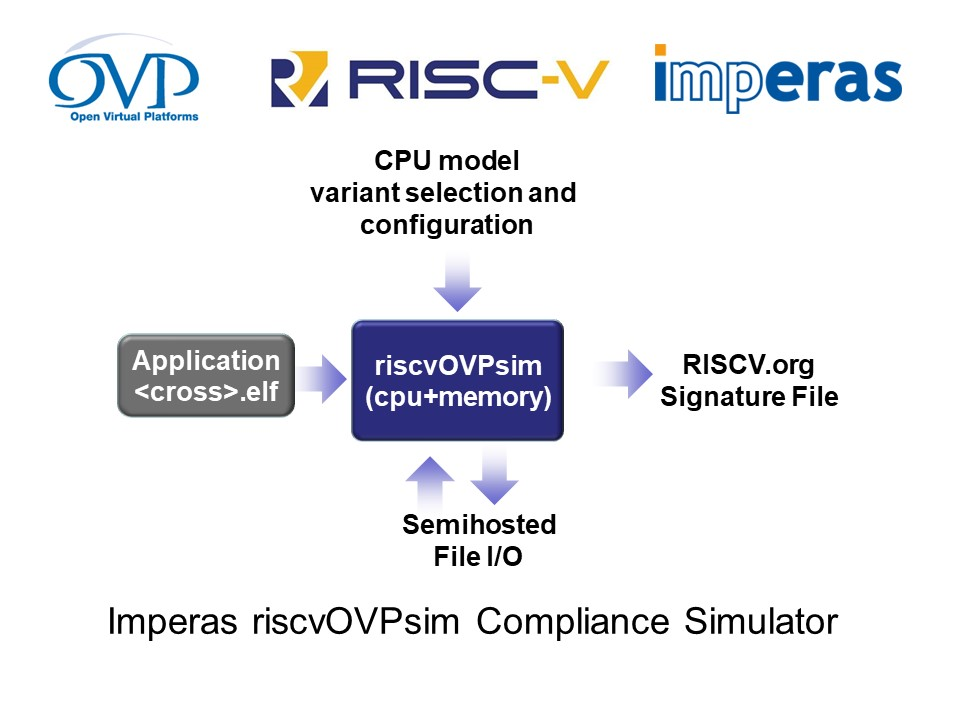

riscvOVPsim
===
A Complete, Fully Functional, Configurable RISC-V Simulator
===

Author: Imperas Software, Ltd., using OVP Open Standard APIs  
Date   : 08 Oct 2020 
Version: 20201008.0  

License: Model source included under Apache 2.0 open source license  
License: Simulator riscvOVPsim licensed under Open Virtual Platforms (OVP) Fixed Platform Kits license

Imperas Simulators
---
Imperas is the leading developer of RISC-V simulators for compliance testing, test development, hardware design verification, and operating system and application software development.

There are three simulators in the Imperas RISC-V range:
- the free riscvOVPsim from GitHub used for compliance testing and bare metal software runs
- the free riscvOVPsimPlus from OVPworld.org (requiring registration) targeting test development and initial hardware verification
- the commercial M*SIM from Imperas Software, Inc., for professional developers, hardware design verification teams, operating system and advanced software developers.

All three simulators are based on the Imperas CpuManager simulator base technology utilizing the OVP open standard APIs, and are targeted at different uses and have different capabilities.

RISC-V Specifications currently supported in the Imperas family of simulators:
- RISC-V Instruction Set Manual, Volume I: User-Level ISA (User Architecture Version 20190305-Base-Ratification)
- RISC-V Instruction Set Manual, Volume II: Privileged Architecture (Privileged Architecture Version 20190405-Priv-MSU-Ratification)
- RISC-V Instruction Set Manual, V Vector Extension
    - with version configurable in the model using the 'vector_version' parameter.
    - 'master' version conforms to specification changes up to 22 July 2020 and is regularly updated to track the evolving specification.
- RISCV Extension B (Bit Manipulation)
    - with version configurable in the model using the 'bitmanip_version' parameter.
    - 'master' version conforms to specification changes up to 0.93 (draft) and is regularly updated to track the evolving specification.
- RISCV Extension H (Hypervisor)(Beta)
- RISCV Extension K Scalar (Crypto)(Beta)
- RISCV Debug Module 0.14.0 (Draft) with version configurable in the model using the 'debug_version' parameter.
  
About riscvOVPsim
---
**riscvOVPsim** is a free download from its GitHub repository and supports only the ratified parts of the RISC-V specification.
**riscvOVPsimPlus** is available as free download (after registration) from [www.OVPworld.org/riscv](https://www.OVPworld.org/riscv) and supports the newer, under development standard ISA extensions and many more simulator features such as trace and debug.

The Imperas RISC-V simulators implement the full and complete functionality of the RISC-V Foundation's public User and Privilege specifications.  They also provide implementations of many of the ISA extensions such as V, B, K, H, etc.

This riscvOVPsim simulator is a free simulator and has some restrictions.

The simulator is command line configurable to enable/disable all current optional and processor specific options. 

The simulator is developed, licensed and maintained by [Imperas Software](http://www.imperas.com/riscv) and it is fully compliant to the OVP open standard APIs. 

As a member of the RISC-V Foundation community of software and hardware innovators collaboratively driving RISC-V adoption, Imperas has developed the family of riscvOVPsim simulators to assist RISC-V adopters to become compliant to the RISC-V specifications.

riscvOVPsim includes an industrial quality model and simulator of RISC-V processors for use for compliance testing purposes. It has been developed for personal, academic, or commercial use, and the model is provided as open source under the Apache 2.0 license. The simulator is provided under the  Open Virtual Platforms (OVP) Fixed Platform Kits license that enables download and usage. Imperas actively maintains, enhances, and supports riscvOVPsim and its use. To ensure you make use of the current version of riscvOVPsim this release will expire. Please download the latest version.

Runtime configurable settings for all enabled RISC-V specification options makes it very easy to use.

Full commercial features are provided including variant selection, RISC-V specification model configuration options, semihosting, and RISC-V compliance group signature dump facility for compliance testing.

The purpose of this **riscvOVPsim** simulator is for running compliance test programs and generating the reference signatures for comparison with devices being tested.

If you need a simulator to use for test development or any form of verification, for example: tracing, GDB/Eclipse debug, or post simulation trace/compare, then you need to use a more feature rich Imperas simulator. Please visit [www.OVPworld.org/riscv](https://www.OVPworld.org/riscv) to access the more advanced simulator. If you are looking for full hardware design verification solutions, such as SystemVerilog encapsulation of the reference model, step/compare/lockstep capabilities, or RISC-V verification IP solutions, then visit [www.imperas.com/riscv](https://www.imperas.com/riscv).

More information: [riscvOVPsim user guide](doc/riscvOVPsim_User_Guide.pdf)  
Model Source: [source](source)  
Examples: [examples](examples)  

  
riscvOVPsim is a fixed function simulation of one configurable processor model in a fixed platform. Full extendable platform simulations of reference designs booting FreeRTOS, Linux, SMP Linux etc. are available as open source and are available from [www.IMPERAS.com](http://www.imperas.com), [www.OVPworld.org](http://www.OVPworld.org).  

Debugging using GDB / Eclipse
---
The same fixed platform can be used to debug the application using GDB and Eclipse.

To use GDB/Eclipse you need the more advanced simulator, please visit [www.OVPworld.org/riscv](https://www.OVPworld.org/riscv) for free access.

Using riscvOVPsim
---
To use the simulator, just download the files, go into one of the example directories, and execute the provided run scripts.
For example on Linux:  

> $ cd examples  
> $ cd fibonacci  
> $ RUN_RV32_fibonacci.sh  
> 
> CpuManagerFixedPlatform (64-Bit) 20180425.0 Open Virtual Platform simulator from [www.IMPERAS.com](http://www.imperas.com).  
> Copyright (c) 2005-2020 Imperas Software Ltd.  Contains Imperas Proprietary Information.  
> Licensed Software, All Rights Reserved.  
> Visit [www.IMPERAS.com](http://www.imperas.com) for multicore debug, verification and analysis solutions.  
>   
> CpuManagerFixedPlatform started: Tue Apr 24 19:12:06 2018  
>   
> Info (OR_OF) Target 'riscvOVPsim/cpu' has object file read from 'fibonacci.RISCV32-O0-g.elf'  
> Info (OR_PH) Program Headers:  
> Info (OR_PH) Type           Offset     VirtAddr   PhysAddr   FileSiz    MemSiz     Flags Align  
> Info (OR_PD) LOAD           0x00000000 0x00010000 0x00010000 0x00016998 0x00016998 R-E   1000  
> Info (OR_PD) LOAD           0x00017000 0x00027000 0x00027000 0x000009c0 0x00000a54 RW-   1000  
> starting fib(38)...  
> fib(0) = 0  
> fib(1) = 1  
> fib(2) = 1  
> fib(3) = 2  
> ...  
> fib(36) = 14930352  
> fib(37) = 24157817  
> finishing...  
> Info   
> Info ---------------------------------------------------  
> Info CPU 'riscvOVPsim/cpu' STATISTICS  
> Info   Type                  : riscv (RVB32I+MACSU)  
> Info   Nominal MIPS          : 100  
> Info   Final program counter : 0x100ac  
> Info   Simulated instructions: 4,400,537,204  
> Info   Simulated MIPS        : 1439.2  
> Info ---------------------------------------------------  
> Info   
> Info ---------------------------------------------------  
> Info SIMULATION TIME STATISTICS  
> Info   Simulated time        : 44.01 seconds  
> Info   User time             : 3.06 seconds  
> Info   System time           : 0.00 seconds  
> Info   Elapsed time          : 3.10 seconds  
> Info   Real time ratio       : 14.18x faster  
> Info ---------------------------------------------------  
>   
> CpuManagerFixedPlatform finished: Tue Apr 24 19:12:10 2018  
>   
> CpuManagerFixedPlatform (64-Bit) 20180425.0 Open Virtual Platform simulator from [www.IMPERAS.com](http://www.imperas.com).  
> Visit [www.IMPERAS.com](http://www.imperas.com) for multicore debug, verification and analysis solutions.  
  
Measuring Instruction Functional Coverage with the riscvOVPsim coverage engine
---
Instruction Functional Coverage as it relates to processor verification is a technology solution to measure what is being stimulated in the ISA in terms of which instructions, operands and values are driven into a processor.

The Imperas coverage technology is developed using the Imperas VAP intercept technology and is provided as part of riscvOVPsim.

Example coverage command:

> $ riscvOVPsim.exe --variant RVB32I --program eg.elf --cover basic --extensions RVI --reportfile impCov.log

The Imperas Instruction Functional Coverage works by monitoring every instruction as it retires and recording information about it.

At the end of simulation this data is summarized in the console and simulation log file.

> COVERAGE :: RVI :: threshold : 1 : instructions: seen 13/40 :  32.50%, coverage points hit: 262/2952 :   8.88%

Full details are provided in the report file.

You can get coverage reports for one run or merge results from many runs. You can select which instruction 
extension to report on, or even select just individual instructions to report on.

There is currently 'basic' and 'extended' coverage measuring.

Please read the [riscvOVPsim user guide](doc/riscvOVPsim_User_Guide.pdf) for full operational instructions.

If a signature comparison based verification methodology is adopted (as in the RISC-V Compliance suites) for comparison 
between device under test and reference, then functional coverage is only part of the story, 
as it is essential to measure the successful propagation of the results of the input instructions/values into the signature. 
Read more about this in the section on Mutation Testing in the [riscvOVPsim user guide](doc/riscvOVPsim_User_Guide.pdf).

The coverage technology provided as part of riscvOVPsim is fixed functionality. The Imperas coverage technology is available as an extension library as source as a standard part of the Imperas commercial
 product offerings and this allows users to extend and modify functionality and coverage capability. Contact Imperas for more information.

Extending riscvOVPsim and building your own models and platforms
---
riscvOVPsim is a fixed function simulation of one configurable processor model in a fixed platform. 
Full extendable platform simulations of reference designs booting FreeRTOS, Linux, SMP Linux etc. 
are available as open source and are available from [www.IMPERAS.com](http://www.imperas.com), 
[www.OVPworld.org](http://www.OVPworld.org).  

About Open Virtual Platforms (OVP) and Imperas Software
---
**Open Virtual Platforms** was created in 2008 to provide an open standard set of APIs and methodology to develop virtual platforms and simulation technology. 
[www.OVPworld.org](http://www.OVPworld.org/riscv).

**Imperas Software Ltd.** is the leading independent commercial developer of virtual platforms and high-performance software simulation solutions for embedded processor and systems. Leading semiconductor and embedded software companies use Imperas simulators for their processor based simulation solutions.
[www.imperas.com](http://www.imperas.com/riscv).

  
  
---

This is the riscvOVPsim/README.md  
